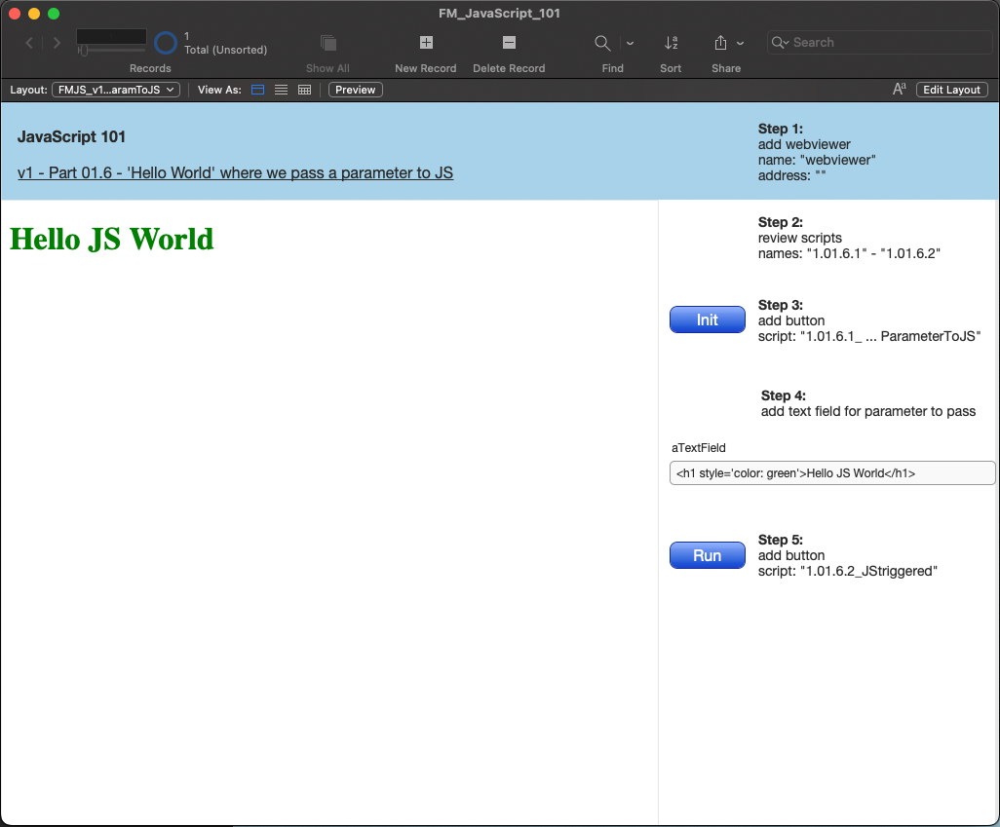

# FM_JavaScript_101

#### A FileMaker Pro & JavaScript integration training aid

Learn how to begin using JavaScript inside FileMaker Pro solutions. After using this training aid, and optionally watching the LiveStream video that goes along with this database training aid, you will have more confidence in learning more about integrating JavaScript into your FileMaker solutions.

#### Prerequisites

This training aid assumes NO prior JavaScript knowledge.
You do need a basic understanding of Filemaker concepts such as Tables, Fields, Layouts, Webviewers, and Scripts.

#### Usage

1. Download and open the zipped Filemaker Pro database

2. At the main menu, click on the pencil icon to launch training

3. Follow the onscreen instructions (on the right):
  * Applicable scripts will be noted
  * scripts that contain JavaScript variables/code will also include comments that will help to explain what is being done
  * helpful resource links are mentioned in script comments in the top header under the Notes line
  * after finishing one section, move to the next one in the Layouts drop-down menu

#### Dependancies

This database uses no additional dependancies.

To write your own JavaScript code you can either use Filemaker's builtin text editors or use a 3rd party text editor of your choice.
